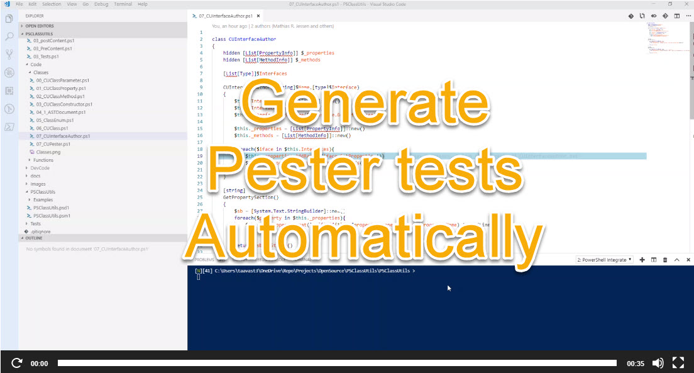

# PSClassUtils


## Summary

PsClassUtils, is a Powershell module which contains tools to ease the work with Powershell Classes.

One cool feature is available is the fact  **that it can generate UML-like Class Diagrams in png format of your scripts / modules in a glimps!** (See ```Write-CUClassDiagram```)

Since version `2.6.0` we have also added the possibility to **automatically generate your pester tests for your entiere module / script / file(s)**.( See ```Write-CUPesterTest``` below.)

-----

## Build Status
|Master |Dev| Downloads
|---|---|---|
|[](https://ci.appveyor.com/project/Stephanevg/psclassutils/branch/master) |[](https://ci.appveyor.com/project/Stephanevg/psclassutils/branch/dev) | [](https://www.powershellgallery.com/packages/PsClassUtils/)

-----
## How to install PSClassUtils

```powershell
Find-module PSClassUtils | install-Module
```

## Release Notes

Release notes can be found here --> [Release Notes](.\ReleaseNotes.md)


## Functions currently available:

```powershell

Get-CUClass
Get-CUClassConstructor
Get-CUClassMethod
Get-CUClassProperty
Get-CUCommands
Get-CUEnum
Get-CULoadedClass
Get-CUPesterDescribeBlock
Get-CUPesterITBlock
Get-CUPesterScript
Install-CUDiagramPrerequisites
Write-CUClassDiagram
Write-CUInterfaceImplementation
Write-CUPesterTest


```


## Write-CUClassDiagram

Allows to generate UML diagrams of powerShell scripts / modules that contain PowerShell classes.


### Prerequisites

This module has a dependency on [Kevin Marquette](https://Twitter/KevinMarquette)'s [PSGraph](https://github.com/KevinMarquette/PSGraph) powershell module.
The prerequisites can be installed either manually, or by using the following methodology:

```powershell

Import-Module PSClassutils
Install-CUDiagramPreRequisites

```

### Functionality

#### Drawings

Write-CUClassDiagram currently allows to draw diagrams (or components of diagrams) of the follow items:
- Document a Class
    - it's Properties
    - it's Methods
    - it's Constructors
    - it's Inheritance

Has a relationships (Composition) is currently not supported. (But is planned for a future release)

#### Inputs

It is possible to draw diagrams from classes in the following different manners:
- On a folder level
    - This will create a diagram and document each independant .ps1 file that contains a class. If no classes are found, it will be an empty square.
- File base (.ps1)
    - you can point the function to a single .ps1 file, and will generate the diagram for all the classes located in that file.
- File base (.psm1)
    - you can point the function to a single .psm1 file, and will generate the diagram for all the classes located in that file.

#### Examples

A script called ```inheritance.ps1``` contains the following code:

```powershell

Class Woop {
    [String]$String
    [int]$number

    Woop([String]$String,[int]$Number){

    }

    [String]DoSomething(){
        return $this.String
    }
}

Class Wap :Woop {
    [String]$prop3

    DoChildthing(){}

}

Class Wep : Woop {
    [String]$prop4

    DoOtherChildThing(){

    }
}

```

#### Calling Write-CUClassDiagram
```Powershell
Write-CUClassDiagram -Path ".\Inheritance.ps1"
```

#### Results


## Live examples from existing modules on the internet:

I took the 'liberty' to run Write-CUClassDiagram on some well known modules available on the internet that are classed based.
These are all great modules, and I recommend you have a look at them!


### Class.HostsManagement

Below is the export of the Class Diagram of a module I wrote that helps to manage HostsFiles accross the network using PowerShell classes. (The project is accessible  [Here](https://github.com/Stephanevg/Class.HostsManagement))


### Poshbot

Write-CUClassDiagram allows to generate diagrams of complex class based modules, and gives you the ability to have a global picture of any project quickly, without reading through the code. PoshBot is probably the best example:


https://github.com/Stephanevg/PSClassUtils/blob/master/PSClassUtils/Examples/06/PoshBot_Diagram.png


## Write-CUPesterTest

Since version `2.6.0` the PsClassUtils module received a few new cmdlets related to pester tests. The most interesting one is without a doubt the: ```Write-CUPesterTest```

As it's name implies, this function allows to automatically generate your pester tests. (Click on the image below for an example.)

<a href="http://powershelldistrict.com/write-cupestertest-demo-org//">]</a>


## Contributing guide

You feel like contributing to this project? Awesome! We are happy to hear that, and will to help you succeed in that.
You can start by reading our [Contribution guide](CONTRIBUTING.MD).

Please don't hesitate to open an issue so we can quickly discuss about implementation details  and design of your, perhaps to be, new feature of PSClassutils :)


## Community contributions

for 'HacktOberFest' I created an issue to push people to use the module on their classes, and PR us their classes + examples.

Here under is the list of community driven contributions:

### AclApp

Thanks to [LxLeChat](https://github.com/LxLeChat) !!

Acl class is used to create a 3 levels folder structure in a standardized way. The acl creates both folders and corresponding groups and set acl.


